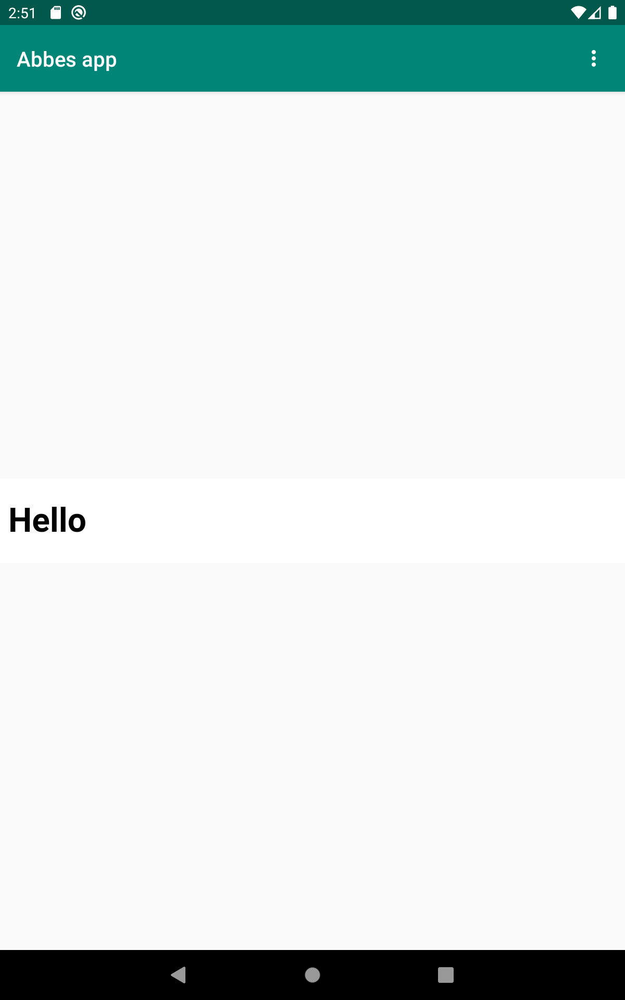
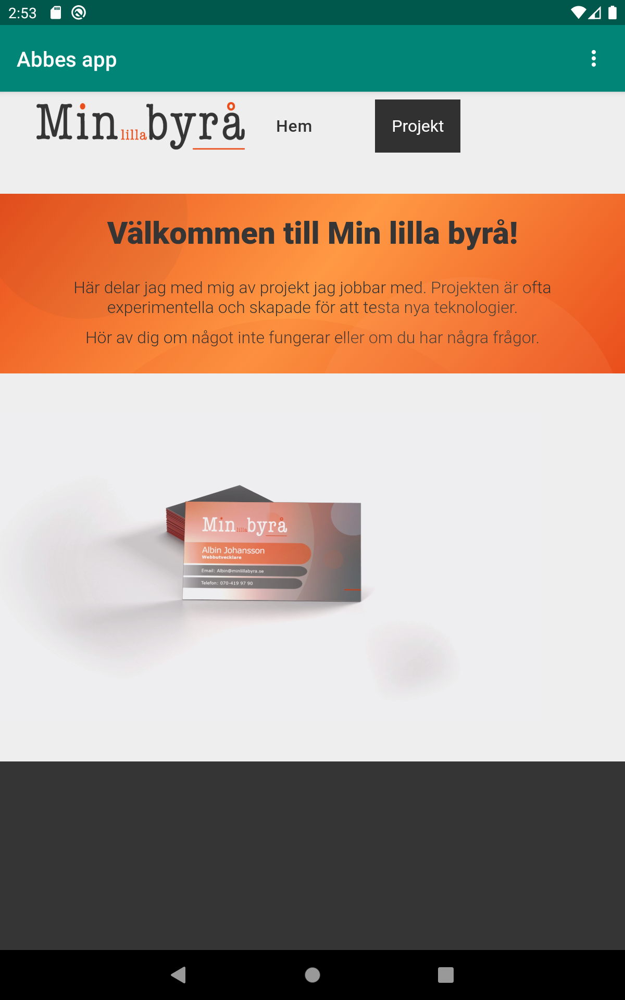

# Rapport

Namnet ändrades till Abbes app i string.xml filen. 
Jag lade till:
```
<uses-permission android:name="android.permission.INTERNET" />
```
i AndroidManifest.xml för att ge applikationen tillgång till 
internet. 

Elementet TextView i activity_main.xml ändrades till WebView och 
ett ID adderades:
```
android:id="@+id/my_webview
```

Jag skapade myWebView variabeln och initierade den samt skapade
en webViewClient och godkänner att webviewn får köra JavaScriptkod
i onCreate funktionen.

```
        myWebView = findViewById(R.id.my_webview);
        myWebView.setWebViewClient(new WebViewClient()); 
        myWebView.getSettings().setJavaScriptEnabled(true);
```

Jag skapade en index.html fil som ska användas för att testa köra 
interna hemsidor och skrev sedan vilken intern och extern url som 
ska visas i funtionerna som styr det.

```
    public void showExternalWebPage(){
        myWebView.loadUrl("https://www.minlillabyra.se");
    }

    public void showInternalWebPage(){
        myWebView.loadUrl("file:///android_asset/index.html");
    }
```

Avslutningsvis gör jag aktuell funktion när man trycker på
valen i menyn.

```
 if (id == R.id.action_external_web) {
    Log.d("==>","Will display external web page");
    showExternalWebPage();
    return true;
}

if (id == R.id.action_internal_web) {
    Log.d("==>","Will display internal web page");
    showInternalWebPage();
    return true;
}
   
```




